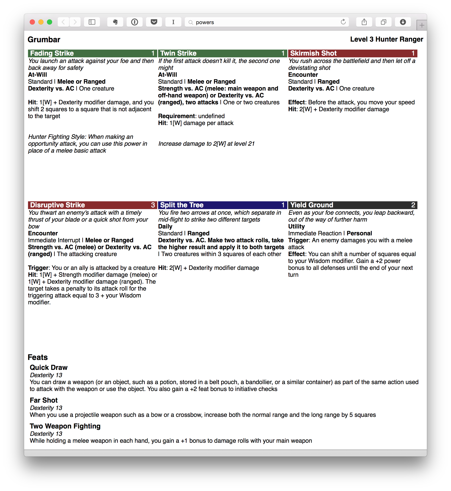

# powerplant

## Installation

First, install [node.js](http://nodejs.org) and npm.

Option 1:
clone this repository:
`git clone https://github.com/bringel/powerplant.git`
then run
`npm install --global`

Option 2:
Run
`npm install bringel/powerplant --global`

## Usage

Usage: powerplant [options]

Options:
   -i FILE, --input FILE    Name of the JSON input file. If you don't specify a file, data will be read from stdin
   -o FILE, --output FILE   name of the output file  [powers.html]
   -f, --format             Format to output the power cards in, either 'html' or 'pdf'  [html]
   --hide-feats             call with --hide-feats to disable generation of feats at the end of the page  [false]
   --hide-header            call with --hide-header to disable generation of the character header at the top of the page  [false]

### Input File Format

powerplant takes a JSON formatted input file with the following structure:

    {
      "character": "Grumbar",
      "level": 3,
      "class" : "Hunter Ranger",
      "race" : "Half-Orc",
      "powers":
      [
        {
          "name": "Split the Tree",
          "type": "Daily", (can also be "Encounter", "At Will" or "Utility")
          "level": 1,
          "description": "You fire two arrows at once, which separate in mid-flight to strike two different targets",
          "action_type": "Standard",
          "effect": null,
          "trigger": null,
          "requirement": null,
          "weapon_type": "Ranged",
          "targets": "Two creatures within 3 squares of each other",
          "attack": "Dexterity vs. AC. Make two attack rolls, take the higher result and apply it to both targets",
          "hit": "2[W] + Dexterity modifier damage",
          "note": null
        },
      ],
      "feats":
      [
        {
          "name": "Quick Draw",
          "prerequisite": "Dexterity 13",
          "benefit": "You can draw a weapon (or an object, such as a potion, stored in a belt pouch, a bandollier, or a similar container) as part of the same action used to attack with the weapon or use the object. You also gain a +2 feat bonus to initiative checks"
        }
      ]
    }

### Output
powerplant will output html that looks like this and optionally save it as a pdf

